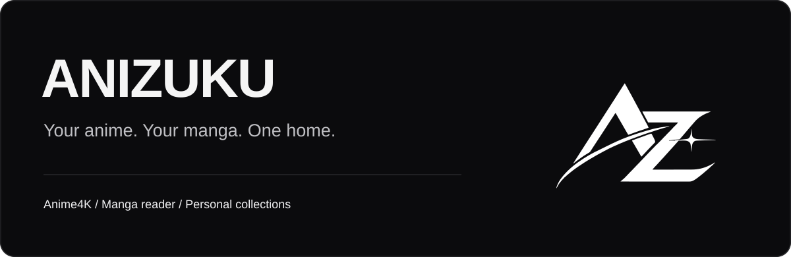

  

  
  
  

  <strong>Watch. Read. Make it yours.</strong> 
  Anime playback, manga reading, and your own collections in one desktop app.

  <a href="https://github.com/Kifyie/anizuku-app/releases"><strong>Releases</strong></a>
  &nbsp; · &nbsp;
  <a href="#inside-anizuku">Features</a>
  &nbsp; · &nbsp;
  <a href="https://github.com/Kifyie/anizuku-app/issues">Report an issue</a>
  &nbsp; · &nbsp;
  <a href="#credits-and-third-party-source">Credits &amp; source</a>

## v0.3.1 beta

This beta brings a smaller online setup, resumable component downloads, safer profile syncing, and clearer support diagnostics. Existing libraries, downloads, preferences, and welcome completion keep their current local data directories.

> [!NOTE]
> **The v0.3.1 beta setup has been built.** The approximately 13 MB online installer and its component files are staged in a draft release. There is no public v0.3.1 download yet; draft assets cannot serve a fresh anonymous installation. Windows signing and the remaining third-party source/licence review must be completed before public distribution.

When the release is available, the **Windows x64 online setup** will be listed on the [releases page](https://github.com/Kifyie/anizuku-app/releases). The roughly 13 MB setup installs a small downloader, then retrieves the protected app and required components. The total download is larger than the installer itself. Interrupted downloads resume, and files are verified before installation.

## Inside Anizuku

| Watch | Read |
| :--- | :--- |
| Anime discovery and playback | Manga and manhwa discovery |
| Anime4K enhancement | Scroll, paged, and book reading views |
| Playback defaults and episode continuity | Comix browser search, chapter lists, and pages |
| Personal collections and watch progress | Reading library, progress, and extension-based downloads |

**Your app, your pace.** Start as a guest with local saves, or sign in for optional cloud sync. Choose your interests and starting section in the welcome flow. AniList and MAL account-link/import flows are optional.

**More reading sources when you need them.** The Comix browser path can work independently of Suwayomi startup. Installed reading extensions provide additional sources and offline chapter downloads. Availability depends on the source and your connection.

## Setup and support

1. Use the Windows x64 setup from a published release.
2. Launch Anizuku after installation and allow the required app/component downloads to finish.
3. Complete or skip the welcome, then choose anime or manga.

For a problem report, include the app version, what you were doing, and the output of **Settings → Data → Copy diagnostics**. That report omits account contents, credentials, media titles, and local paths. Keep profile backup exports private.

Never include passwords, session tokens, or private save exports in a public issue. Source availability and chapter/page failures can vary independently; describe which stage failed.

## Credits and third-party source

Anizuku's original application code and streaming adapters remain closed source. This repository hosts branding, release files, download metadata, and third-party compliance material. It does not grant a blanket licence over the application or bundled third-party components.

<strong>Projects behind the app</strong>

Anizuku uses Electron and Chromium for its desktop/browser host, Python for its local backend, and Suwayomi for installed reading extensions. Other components include FFmpeg, Java/Temurin, ZPAQ, React, and UI libraries. Discovery metadata comes from providers including AniList, MangaBaka, and TMDB.

Exact notices and credits remain readable inside **Settings → About & credits**, including offline. Each dependency, adapter, and runtime keeps its applicable licence and attribution requirements. The application licence preserves those third-party rights.

<strong>Corresponding source and provenance</strong>

- [Exact Suwayomi source](third-party-source/Suwayomi-Server-v2.3.2243-source.zip), [provenance](third-party-source/suwayomi-source-provenance.json), and [MPL-2.0 licence](third-party-source/LICENSE-MPL-2.0.txt).
- [Matching Java source/build provenance](third-party-source/java-source-provenance.json) and [upstream build metadata](third-party-source/OpenJDK25U-jre_x64_windows_hotspot_25.0.4.1_1.zip.json). The provenance links the exact upstream source archive and its SHA-256.
- A separate corresponding-source package is staged with the release. Exact FFmpeg/applicable dependency source and build evidence, font/icon entitlements, and final artifact review remain pending. These are release gates, not completed compliance claims.

Third-party source and modifications required by their licences will be supplied separately. Unrelated proprietary application files are not included.

---

   
  <strong>ANIZUKU</strong> 
  Free to use. No ads. Built for watching and reading.

